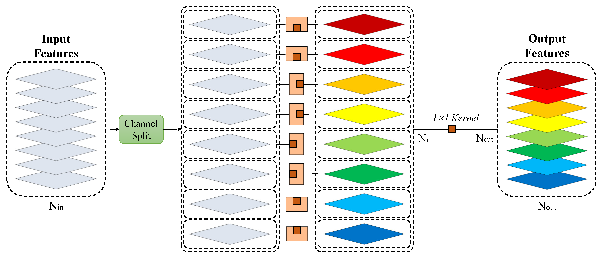

# SW_ModelCompression

This is the Pytorch implementation for "[A general model compression method for image restoration network](https://doi.org/10.1016/j.image.2021.116134)".

### SWConv

The *SWConv* is depicted as follows:


### SWConv-F

The *SWConv-F* is depicted as follows:



### SW-Models

The SW-DnCNN, SW-RCAN and SW-DnCNN-3 are implemented in SWDnCNN.py, SWRCAN.py and SWDnCNN3.py, respectively. The original networks can be replaced by the corresponding ones for retraining and test.

### Reference
If you find this project useful, we would be grateful if you cite this paper：
```
@article{model_compression,
author = {Jie Xiao, Zhi Jin*, Huanrong Zhang},
journal = {Signal Processing: Image Communication},
title = {A general model compression method for image restoration network},
year = {2021}
}
```
### License
This repository is released under the MIT License as found in the LICENSE file. Code in this repo is for non-commercial use only.
